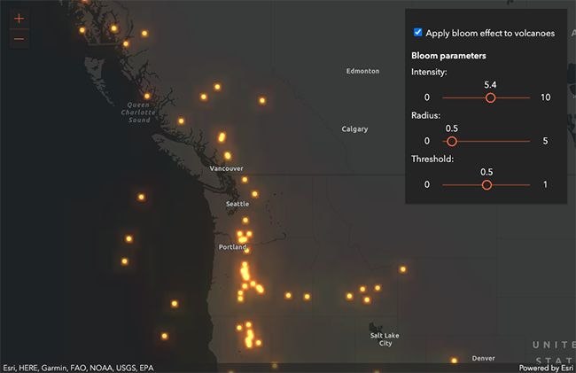
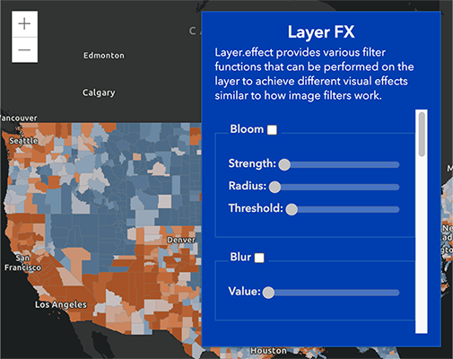
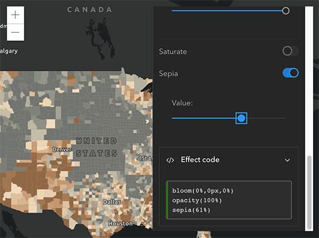

<!-- .slide: data-background="../node_modules/esri-reveal.js-templates/img/2021/dev-summit/bg-1.png" data-background-size="cover" -->
<!-- Presenter: Matt -->

# ArcGIS API for JavaScript: Customizing Widgets

### Matt Driscoll – [@driskull](https://twitter.com/driskull)

### JC Franco – [@arfncode](https://twitter.com/arfncode)

---

# Agenda

- What can be customized
- Customization approaches with demos

---

# Customizing Widgets

- Theming <!-- .element: class="fragment" data-fragment-index="1" -->
  - Changing styles: colors, sizing, font, etc.
- Extending and altering presentation of a widget <!-- .element: class="fragment" data-fragment-index="2" -->
  - Altering presentation
  - Adding functionality

---

# Customization Approaches

- Authoring a theme <!-- .element: class="fragment" data-fragment-index="1" -->
- Extending: Altering a view <!-- .element: class="fragment" data-fragment-index="2" -->
- Extending: Adding functionality to a view <!-- .element: class="fragment" data-fragment-index="3" -->

---

<!-- Presenter: Franco -->

<h1>Part I</h1>

<h2>Theming</h2>

<!-- .slide: data-background="../node_modules/esri-reveal.js-templates/img/2021/dev-summit/bg-3.png" data-background-size="cover"  -->

---

# Part I: Theming

## Why Theme? <!-- .element: class="fragment" data-fragment-index="0" -->

- Match branding.
- Contrast with the map.
- User-specific (e.g. bigger buttons).

<!-- .element: class="fragment" data-fragment-index="1" -->

---

# Esri Themes

10 themes are provided **out-of-the-box**:

Using a theme requires only a slight update to the CSS path.

```html
<link rel="stylesheet" href="https://js.arcgis.com/<version>/esri/themes/<theme-name>/main.css" />
```

---

<!-- .slide: data-background="../node_modules/esri-reveal.js-templates/img/2021/dev-summit/bg-4.png" data-background-size="cover"  -->

**Theme Switcher**

[Out-of-the-box themes](../demos/out-of-the-box-themes/)

---

# Theming Technology

---

We use


### to create our CSS.

<!-- .element: class="fragment" data-fragment-index="1" -->
<!-- .element: class="fragment" data-fragment-index="1" -->

<small><a href="https://nodejs.org/">nodejs.org</a> | <a href="https://gruntjs.com/">gruntjs.com</a></small><!-- .element: class="fragment" data-fragment-index="1" -->

---


### is a powerful scripting language for compiling CSS.

- It's modular.
- It's DRY.
- It makes theming easy.

<!-- .element: class="fragment" data-fragment-index="1" -->

---

# Theming Steps

1.  Get our theme utility.
1.  Use the utility.
1.  Customize your theme.
1.  Host your CSS file.

<!-- .element: class="fragment" data-fragment-index="1" -->

---

# Step 1

Clone the repo.<br/>
<a href="https://github.com/jcfranco/jsapi-styles" target="_blank">https://github.com/jcfranco/jsapi-styles</a>

```
git clone https://github.com/jcfranco/jsapi-styles.git
```

---

# Step 2

`npm install`

- Installs the necessary bits.
- Creates a sample theme directory.
- Compiles the CSS from the SCSS.
- Spins up a preview in your default browser.

<!-- .element: class="fragment" data-fragment-index="1" -->

---

# Step 3

Edit your theme.<br/>
`sass/my-theme/main.scss`

<div>

<!-- intentional space after <div> above (for markdown rendering) -->

Optionally, edit your app.<br/>
`preview/index.html`

</div><!-- .element: class="fragment" data-fragment-index="1" -->

---

# Step 4

Host your stylesheet and any relevant assets.

Link your stylesheet in your app.

```html
<!-- In your app: -->
<link href="path/to/your/theme/main.css" rel="stylesheet" />
```

---

# Goals

Theme Smart

- Avoid adding additional CSS selectors
- Instead, use Sass to your advantage

---

# Theme Structure

Let's look at how the core theme is structured

- Color <span>: `_color.scss`</span><!-- .element: class="fragment" data-fragment-index="1" -->
- Size <span>: `_sizes.scss`</span><!-- .element: class="fragment" data-fragment-index="1" -->
- Type <span>: `_type.scss`</span><!-- .element: class="fragment" data-fragment-index="1" -->

---

# Theme Structure

### Default

```scss
// Inside base/_color_.scss
$background-color: #fff !default;
```

Any value assignment overrides the `!default` value.

```scss
// Inside sass/my-theme/main.scss
$background-color: #1e0707;
```

But wait...there's more!<!-- .element: class="fragment" data-fragment-index="1" -->

---

# Theme Structure

Override the core color variables...

```scss
$font-color: #3a5fe5;
$interactive-font-color: #ff1515;
$background-color: #1e0707;
$button-color: #8070cc;
```

...then magic!<!-- .element: class="fragment" data-fragment-index="1" -->

---

# Magic

Using `$button-color` we "automagically" set the hover color.

```scss
$button-color--hover: darken($button-color, 10%) !default;
// ...etc
```

[API Styling Guide](https://developers.arcgis.com/javascript/latest/guide/styling/index.html#sassy-widgets)

---

# Part I: Let's make a theme

<!--  -->

---

<!-- .slide: data-background="../node_modules/esri-reveal.js-templates/img/2021/dev-summit/bg-4.png" data-background-size="cover" -->

**Custom Theme**

<!-- preview page requires utility to be running -->

[Preview](http://localhost:3001/preview/) | [Demo Steps](../demos/custom-theme/STEPS.md)

---

# Part I: Theming Recap

- Use the utility for easy theming.
- Theme structure
  - Color
  - Size
  - Typography
- Use the core and override values.

---

<!-- NEXT PART  A -->
<h1>End Part I</h1>

<!-- .slide: data-background="../node_modules/esri-reveal.js-templates/img/2021/dev-summit/bg-3.png" data-background-size="cover"  -->

---

<!-- NEXT PART  B -->
<h1>Part II</h1>

<h2>Views</h2>

<!-- .slide: data-background="../node_modules/esri-reveal.js-templates/img/2021/dev-summit/bg-3.png" data-background-size="cover"  -->

---

<!-- Presenter: Matt -->

# Part II: Widget Composition

Widgets are composed of Views & ViewModels

- Logic is separate from presentation
- Reusable
- UI replacement
- Framework integration

<!-- .element: class="fragment" data-fragment-index="1" -->

---

# Part II: TypeScript

- Widgets written in TypeScript (Typed JavaScript)
- JS of the future, now <!-- .element: class="fragment" data-fragment-index="1" -->
- IDE support <!-- .element: class="fragment" data-fragment-index="2" -->
  - Visual Studio
  - WebStorm
  - Sublime
  - and more!

---

# Part II: Views

- Presentation of the Widget
- Uses ViewModel APIs to render the UI
- View-specific logic resides here
- Extend `esri/widgets/Widget`

<!-- .element: class="fragment" data-fragment-index="1" -->

---

# Part II: Widget Class

`esri/widgets/Widget`

- Provides lifecycle
- API consistency

<!-- .element: class="fragment" data-fragment-index="1" -->

---

# Part II: Widget Lifecycle

- &shy;<!-- .element: class="fragment" data-fragment-index="1" --> `constructor`
- &shy;<!-- .element: class="fragment" data-fragment-index="2" --> `postInitialize`
- &shy;<!-- .element: class="fragment" data-fragment-index="3" --> `render`
- &shy;<!-- .element: class="fragment" data-fragment-index="4" --> `destroy`

---

# Part II: `render`

- Defines UI
- Reacts to state
- Uses JSX
- VDOM

<!-- .element: class="fragment" data-fragment-index="1" -->

---

# Part II: Working with Views

API Exploration

- [BasemapToggle Doc](https://developers.arcgis.com/javascript/latest/api-reference/esri-widgets-BasemapToggle.html)

---

# Part II: Views Recap

What have we learned about Widget Views?

- Face of the widget
- Present ViewModel logic
- ViewModel separation
  - Allows framework integration/custom views
- Downloadable on API docs

<!-- .element: class="fragment" data-fragment-index="1" -->

---

<!-- NEXT PART  A -->
<h1>End Part II</h1>

---

# Part III: Extending a View

- Why? <!-- .element: class="fragment" data-fragment-index="1" -->
  - Reusable <!-- .element: class="fragment" data-fragment-index="2" -->
  - Same ecosystem <!-- .element: class="fragment" data-fragment-index="3" -->
- How? <!-- .element: class="fragment" data-fragment-index="4" -->
  - &shy;<!-- .element: class="fragment" data-fragment-index="5" --> Leveraging `esri/widgets/Widget`
  - API widget views <!-- .element: class="fragment" data-fragment-index="6" -->

---

# Part III: Lets extend a View

- View custom LayerFX widget
- Extend the LayerFX widget view
  - Use Esri's design system web components
  - Alter the presentation of the widget

---

# [Esri's design system](https://github.com/Esri/calcite-components)

- Design patterns and practices
- Web components
  - Custom, reusable, encapsulated HTML tags
  - Quickly build Esri branded, lightweight, and accessible web apps

[CalciteButton](https://esri.github.io/calcite-components/?path=/story/components-button--simple)

```html
<calcite-button>
  My Button!
</calcite-button>
```

---

# Part III: Background

Inspired by [Intro to layer effect](https://developers.arcgis.com/javascript/latest/sample-code/intro-effect-layer/) sample

<a target="_blank" href="https://developers.arcgis.com/javascript/latest/sample-code/intro-effect-layer/"></a>

---

<!-- .slide: data-background="../node_modules/esri-reveal.js-templates/img/2021/dev-summit/bg-4.png" data-background-size="cover" -->

# View LayerFX widget

[Demo Start](../demos/start/)

<a target="_blank" href="../demos/start/"></a>

---

# Part III: LayerFX Interface

```ts
interface LayerFX extends Accessor {
  layer: Layer;
  readonly effects: Collection<LayerEffect>;
  readonly statements: string;
}

interface LayerEffect {
  enabled: boolean;
  id: "bloom" | "blur" | ... | "sepia";
  values: number[];
  readonly valueTypes: { unit: string; ... }[];
  readonly statement: string;
}
```

---

# ArcGIS API for JavaScript:<br /> Building Your Own Widget

Thursday 8 April 2021 @ 10:15 a.m.

---

<!-- .slide: data-background="../node_modules/esri-reveal.js-templates/img/2021/dev-summit/bg-4.png" data-background-size="cover" -->

# Extend LayerFX widget

- [Demo Start](../demos/start/)
- [Demo Steps](../demos/start/STEPS.md)



---

# Part III: Extendint Recap

- Extended an existing widget view
- Replaced render methods
- Altered presentation using Esri's design system components
- Updated private methods where necessary

---

<!-- Presenter: Franco -->

<!-- NEXT PART  B -->
<h1>Part IV</h1>

<h2>Adding functionality to a view</h2>

<!-- .slide: data-background="../node_modules/esri-reveal.js-templates/img/2021/dev-summit/bg-3.png" data-background-size="cover"  -->

---

# Part IV: Adding Functionality to a view

---

<!-- .slide: data-background="../node_modules/esri-reveal.js-templates/img/2021/dev-summit/bg-4.png" data-background-size="cover"  -->

# Part IV: Adding Functionality to a view

**CustomScaleRangeSlider (revisited)**

[API Reference](https://developers.arcgis.com/javascript/latest/api-reference/esri-widgets-ScaleRangeSlider.html) |
[Demo](../demos/custom-scalerangeslider-extended-start/) |
[Steps](../demos/custom-scalerangeslider-extended-start/STEPS.md)

<!--  -->

---

# Part IV: Adding Functionality to a view

- Reusable <!-- .element: class="fragment" data-fragment-index="1" -->
  - View/ViewModel <!-- .element: class="fragment" data-fragment-index="1" -->
- Same ecosystem <!-- .element: class="fragment" data-fragment-index="2" -->
  - No extra libraries <!-- .element: class="fragment" data-fragment-index="2" -->
- Extended existing widget <!-- .element: class="fragment" data-fragment-index="3" -->
  - Lifecycle <!-- .element: class="fragment" data-fragment-index="3" -->
  - TypeScript <!-- .element: class="fragment" data-fragment-index="3" -->

---

<!-- NEXT PART A -->
<h1>End Part IV</h1>

<!-- .slide: data-background="../node_modules/esri-reveal.js-templates/img/2021/dev-summit/bg-3.png" data-background-size="cover"  -->

---

# Conclusion

- Authored a theme <!-- .element: class="fragment" data-fragment-index="1" -->
- Extended a view <!-- .element: class="fragment" data-fragment-index="2" -->
  - Customized presentation <!-- .element: class="fragment" data-fragment-index="3" -->
  - Added functionality <!-- .element: class="fragment" data-fragment-index="4" -->

---

## Additional Resources

- [Implementing Accessor](https://developers.arcgis.com/javascript/latest/guide/implementing-accessor/index.html)
- [Setting up TypeScript](https://developers.arcgis.com/javascript/latest/guide/typescript-setup/index.html)
- [Widget Development](https://developers.arcgis.com/javascript/latest/guide/custom-widget/index.html)
- [Styling](https://developers.arcgis.com/javascript/latest/guide/styling/)
- [ArcGIS API for JavaScript - next](https://github.com/Esri/feedback-js-api-next)

---

## You might also be interested in...

- ArcGIS API for JavaScript: Building Your Own Widget
- Esri Design System: Build compelling web apps faster using the new web component library
- ArcGIS API for JavaScript: Getting Started with Web Development
- ArcGIS API for JavaScript: Programming Patterns and API Fundamentals
- Accessible Web Mapping Apps: ARIA, WCAG and 508 Compliance

---

# Questions? 🤔

> Where can I find the slides/source?

[bit.ly/buildwidgetsds21](http://bit.ly/buildwidgetsds21)

> Where can I submit a question?

[bit.ly/askjsapi](http://bit.ly/askjsapi)

---

<section data-markdown data-background="../node_modules/esri-reveal.js-templates/img/2021/dev-summit/bg-5.png">


